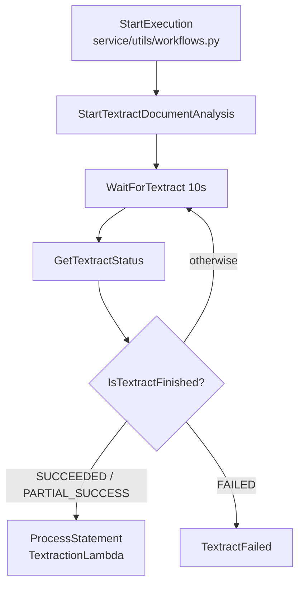

# Statement Processor — Technical Reference (Skeleton)

This repository contains a serverless system for processing supplier statements end‑to‑end. It orchestrates ingestion, extraction, matching, and persistence of statement data, and exposes operational and integration touchpoints for downstream systems. This README is a structured placeholder for long‑term technical documentation.

## Table of Contents
1. [Purpose of This System](#1-purpose-of-this-system)
2. [Domain Concepts & Glossary](#2-domain-concepts--glossary)
3. [High-Level Architecture Overview](#3-high-level-architecture-overview)
4. [End-to-End Data Flow](#4-end-to-end-data-flow)
   - [4.1 Happy Path](#41-happy-path)
   - [4.2 Failure & Anomaly Paths](#42-failure--anomaly-paths)
5. [Repository Structure](#5-repository-structure)
6. [Infrastructure (CDK)](#6-infrastructure-cdk)
7. [Orchestration (Step Functions & Textract)](#7-orchestration-step-functions--textract)
8. [Compute Layer](#8-compute-layer)
   - [8.1 Lambdas / Containers](#81-lambdas--containers)
   - [8.2 Flask Service](#82-flask-service)
9. [Data Model](#9-data-model)
   - [9.1 DynamoDB](#91-dynamodb)
   - [9.2 S3 Layout](#92-s3-layout)
10. [Matching & Anomaly Detection Logic](#10-matching--anomaly-detection-logic)
11. [External Integrations](#11-external-integrations)
12. [Local Development](#12-local-development)
13. [Deployment](#13-deployment)
14. [Observability & Operations](#14-observability--operations)
15. [Security Model](#15-security-model)
16. [Troubleshooting Guide](#16-troubleshooting-guide)
17. [Design Rationale (Why things are the way they are)](#17-design-rationale-why-things-are-the-way-they-are)

## 1. Purpose of This System
- TODO: Document the business objective and primary outcomes.
- TODO: Document the types of statements processed and supported formats.
- TODO: Document primary users and consuming systems.
- TODO: Document key non‑functional goals (throughput, latency, cost, accuracy).

## 2. Domain Concepts & Glossary
- TODO: Document core domain entities (e.g. statement, supplier, tenant, match).
- TODO: Document lifecycle stages and state transitions.
- TODO: Document key metrics and operational definitions.
- TODO: Document any domain‑specific terminology used in code and logs.

## 3. High-Level Architecture Overview
- TODO: Document major components and their responsibilities.
- TODO: Document trust boundaries and system edges.
- TODO: Document storage, compute, and orchestration layers at a glance.
- TODO: Document the primary entry points into the system.

## 4. End-to-End Data Flow
- TODO: Document the ingestion sources and triggers.
- TODO: Document the processing pipeline stages and data transformations.
- TODO: Document the persistence points and output artefacts.

### 4.1 Happy Path
- TODO: Document the standard processing sequence from ingestion to completion.
- TODO: Document state transitions and emitted events for the success path.
- TODO: Document where acknowledgements or callbacks occur.

### 4.2 Failure & Anomaly Paths
- TODO: Document error handling strategy and retries.
- TODO: Document dead‑letter flows, quarantine storage, and alerts.
- TODO: Document partial failure scenarios and recovery actions.
- TODO: Document idempotency behaviour and duplicate handling.

## 5. Repository Structure
- Major domains (top‑level directories):
  - `cdk/`: Infrastructure‑as‑code for provisioning AWS resources (CDK app and stacks).
  - `lambda_functions/`: Lambda/container workloads; currently hosts the Textraction Lambda codebase.
  - `service/`: Flask service, web assets, and service‑level tests.
  - `scripts/`: One‑off utilities and operational scripts (e.g. data maintenance, sample artefacts).
- Shared libraries (internal to this repo):
  - `service/core` and `service/utils`: shared domain logic and helpers for the Flask service.
  - `lambda_functions/textraction_lambda/core`: shared extraction, transformation, and validation logic for the Textraction Lambda.
- Directory tree (excluding `.git`, `venv`, `__pycache__`, `node_modules`, and build artefacts):
```text
.
├── AGENTS.md
├── Makefile
├── README.md
├── update_dependencies.sh
├── cdk/
│   ├── app.py
│   ├── requirements.txt
│   └── stacks/
│       ├── __init__.py
│       └── statement_processor.py
├── lambda_functions/
│   └── textraction_lambda/
│       ├── Dockerfile
│       ├── config.py
│       ├── exceptions.py
│       ├── logger.py
│       ├── main.py
│       ├── pyproject.toml
│       ├── requirements.txt
│       ├── requirements-dev.txt
│       ├── run_static_checks.sh
│       ├── core/
│       │   ├── __init__.py
│       │   ├── date_utils.py
│       │   ├── extraction.py
│       │   ├── get_contact_config.py
│       │   ├── models.py
│       │   ├── textract_statement.py
│       │   ├── transform.py
│       │   └── validation/
│       │       ├── __init__.py
│       │       ├── anomaly_detection.py
│       │       └── validate_item_count.py
│       └── tests/
├── scripts/
│   ├── add_config_to_ddb/
│   │   ├── requirements.txt
│   │   └── temp_add_config_to_ddb.py
│   ├── check_duplicate_invoice_ids/
│   │   └── check_duplicate_invoice_ids.py
│   ├── clear_ddb_and_s3/
│   │   ├── clear_ddb_and_s3.py
│   │   └── requirements.txt
│   ├── generate_example_pdf/
│   │   ├── create_example_pdf.py
│   │   ├── create_test_pdf.py
│   │   ├── move_statement_img.sh
│   │   ├── requirements.txt
│   │   └── sample_statement.png
│   └── populate_xero/
│       ├── populate_xero.py
│       └── requirements.txt
└── service/
    ├── app.py
    ├── cache_provider.py
    ├── config.py
    ├── Dockerfile
    ├── logger.py
    ├── pyproject.toml
    ├── pytest.ini
    ├── requirements.txt
    ├── requirements-dev.txt
    ├── run_as_container.sh
    ├── sync.py
    ├── tenant_data_repository.py
    ├── xero_repository.py
    ├── core/
    │   ├── __init__.py
    │   ├── contact_config_metadata.py
    │   ├── date_utils.py
    │   ├── get_contact_config.py
    │   ├── item_classification.py
    │   └── models.py
    ├── playwright_tests/
    │   ├── helpers/
    │   └── tests/
    ├── static/
    │   └── assets/
    ├── templates/
    ├── tests/
    └── utils/
        ├── __init__.py
        ├── auth.py
        ├── dynamo.py
        ├── formatting.py
        ├── statement_view.py
        ├── storage.py
        ├── tenant_status.py
        └── workflows.py
```

## 6. Infrastructure (CDK)
**Stack entry points and environments**
- `cdk/app.py`: defines two stacks, `StatementProcessorStackDev` and `StatementProcessorStackProd`, both instantiating `StatementProcessorStack` (stage `dev`/`prod`) in `eu-west-1`.
- `cdk/stacks/statement_processor.py`: implements `StatementProcessorStack`, which owns all resources listed below.

**Major constructs and resources** (from `cdk/stacks/statement_processor.py`)
- **DynamoDB tables**
  - `TenantStatementsTable` (`tenant_statements_table`): statement‑level records; GSIs `TenantIDCompletedIndex` and `TenantIDStatementItemIDIndex` support filtering by completion status and per‑item lookups (see inline comments).
  - `TenantContactsConfigTable` (`tenant_contacts_config_table`): shared table wired into both App Runner and the Textraction Lambda via env vars and IAM grants, so it acts as shared per‑tenant configuration/state (details of contents TODO (needs verification)).
  - `TenantDataTable` (`tenant_data_table`): shared tenant data table wired into both App Runner and the Textraction Lambda via env vars and IAM grants (details of contents TODO (needs verification)).
- **S3 bucket**
  - `dexero-statement-processor-{stage}` (`s3_bucket`): shared object store referenced by both App Runner and the Textraction Lambda; includes an explicit bucket policy to allow Textract to read statement PDFs.
- **Lambda**
  - `TextractionLambda` (`textraction_lambda`): container‑image Lambda built from `lambda_functions/textraction_lambda` to perform statement extraction; invoked by the Step Functions state machine (`ProcessStatement` task).
  - `TextractionLambdaLogGroup` (`textraction_log_group`): explicit log group with stage‑dependent retention (3 months in prod, 1 week otherwise).
- **Step Functions**
  - `TextractionStateMachine` (`state_machine`): orchestrates `StartTextractDocumentAnalysis` → `WaitForTextract` → `GetTextractStatus` → `ProcessStatement`, with success/failure handling for Textract job status.
- **App Runner**
  - `Statement Processor Website` (`web`): App Runner service built from `service/` (`AppRunnerImage`) to run the Flask service; uses an instance role to access DynamoDB, S3, Textract, and Step Functions.
- **IAM roles and policies**
  - `Statement Processor App Runner Instance Role` (`statement_processor_instance_role`): grants App Runner access to CloudWatch metrics, Textract, and Step Functions; table and S3 permissions are added via grants.
  - `parameter_policy`: allows App Runner to read `/StatementProcessor/*` from SSM Parameter Store and decrypt SecureStrings (KMS), used via `web.add_to_role_policy(...)`.
  - Textract permissions added to both Lambda and state machine roles to allow `StartDocumentAnalysis` and `GetDocumentAnalysis`.
- **CloudWatch + SNS**
  - `StatementProcessorAppRunnerErrorMetricFilter` + `StatementProcessorAppRunnerErrorAlarm`: parses App Runner application logs for `ERROR` and raises an alarm.
  - `StatementProcessorAppRunnerErrorTopic`: SNS topic with email subscriptions for alarm notifications.

**Environment variables defined in CDK**
- **Textraction Lambda (`TextractionLambda`)**
  - `STAGE`
  - `S3_BUCKET_NAME`
  - `TENANT_CONTACTS_CONFIG_TABLE_NAME`
  - `TENANT_STATEMENTS_TABLE_NAME`
  - `TENANT_DATA_TABLE_NAME`
- **App Runner service (`Statement Processor Website`)**
  - `STAGE`
  - `DOMAIN_NAME`
  - `POWERTOOLS_SERVICE_NAME`
  - `LOG_LEVEL`
  - `MAX_UPLOAD_MB`
  - `S3_BUCKET_NAME`
  - `TENANT_CONTACTS_CONFIG_TABLE_NAME`
  - `TENANT_STATEMENTS_TABLE_NAME`
  - `TENANT_DATA_TABLE_NAME`
  - `TEXTRACTION_STATE_MACHINE_ARN`
  - `XERO_CLIENT_ID_PATH`
  - `XERO_CLIENT_SECRET_PATH`

**Outputs**
- No CloudFormation outputs are defined in `cdk/stacks/statement_processor.py` (no `CfnOutput` usage).

## 7. Orchestration (Step Functions & Textract)
**State machine definitions and entry points**
- `TextractionStateMachine` is defined in `cdk/stacks/statement_processor.py` as a single chainable state machine built from `StartTextractDocumentAnalysis` -> `WaitForTextract` -> `GetTextractStatus` -> `IsTextractFinished?` -> `ProcessStatement` or `TextractFailed`.
- Executions are started from the Flask service via `service/utils/workflows.py:start_textraction_state_machine`, invoked during upload in `service/app.py:_process_statement_upload`.

**Sync vs async Textract flow**
- The workflow uses Textract's async API (`startDocumentAnalysis`) and polls for completion (`getDocumentAnalysis`) in Step Functions (`cdk/stacks/statement_processor.py`).
- The Lambda fetches results with `textract_client.get_document_analysis` (paginated) in `lambda_functions/textraction_lambda/core/extraction.py` and transforms them in `lambda_functions/textraction_lambda/core/textract_statement.py`.
- No synchronous Textract API usage is defined in this repo (e.g. `AnalyzeDocument` / `DetectDocumentText`) in orchestration code; if added later, update here.

**Callback handling**
- No callback pattern is implemented. There are no SNS/SQS/Lambda callback tokens in the state machine definition, and no subscription wiring in CDK for Textract job completion. The workflow relies on polling (`WaitForTextract` + `GetTextractStatus`) in Step Functions.

**Retries, timeouts, failure states**
- State machine timeout is 30 minutes (`cdk/stacks/statement_processor.py`, `TextractionStateMachine`).
- Polling cadence is a fixed 10 second wait between status checks (`WaitForTextract`).
- Failure state is `TextractFailed` when Textract reports `FAILED` (`IsTextractFinished?` choice).
- No explicit `Retry` or `Catch` policies are defined on the Step Functions tasks in CDK; any service default retries are TODO (needs verification).

**Idempotency strategy (where implemented)**
- Step Functions execution name is derived from `tenant_id` and `statement_id` (`service/utils/workflows.py`), and `ExecutionAlreadyExists` is treated as success. This prevents duplicate executions for the same statement.
- Within the Lambda, per-item rows are deleted and re-inserted on each run to avoid duplicate items and preserve completion flags (`lambda_functions/textraction_lambda/core/textract_statement.py:_persist_statement_items`).

**Step-by-step flow (code-grounded)**
1. Upload handler registers statement metadata and starts the state machine (`service/app.py:_process_statement_upload` -> `service/utils/workflows.py:start_textraction_state_machine`).
2. Step Functions calls Textract `startDocumentAnalysis` with the S3 PDF location (`StartTextractDocumentAnalysis` in `cdk/stacks/statement_processor.py`).
3. Workflow waits 10 seconds (`WaitForTextract`).
4. Workflow calls `getDocumentAnalysis` to check `JobStatus` (`GetTextractStatus`).
5. If status is `SUCCEEDED` or `PARTIAL_SUCCESS`, invoke `TextractionLambda` with job id + S3 keys (`ProcessStatement`).
6. If status is `FAILED`, transition to `TextractFailed` (explicit failure).
7. Otherwise, loop back to wait and poll again until timeout.
8. Lambda retrieves paginated Textract results, builds statement JSON, persists items, and writes JSON to S3 (`lambda_functions/textraction_lambda/core/extraction.py` + `lambda_functions/textraction_lambda/core/textract_statement.py`).

**Workflow diagram (Mermaid)**


## 8. Compute Layer
- TODO: Document compute responsibilities and workload distribution.
- TODO: Document runtime versions and shared runtime dependencies.
- TODO: Document cold start considerations and optimisation strategies.

### 8.1 Lambdas / Containers

**Textraction Processing Lambda**

- **Entry point**
  - Handler: `lambda_functions/textraction_lambda/main.py:lambda_handler`
  - Container image: `lambda_functions/textraction_lambda/Dockerfile`
  - Invoked by: Step Functions task **`ProcessStatement`**
  - Defined in: `cdk/stacks/statement_processor.py`

- **Purpose**
  - Perform post-Textract processing
  - Validate incoming Step Functions event
  - Fetch Textract results
  - Build structured statement JSON
  - Persist statement data
  - Write final JSON output to S3

- **Trigger source**
  - Step Functions **`TextractionStateMachine`**
  - Task type: `LambdaInvoke`
  - Task name: `ProcessStatement`

- **Inputs**
  - Step Functions payload validated by  
    `lambda_functions/textraction_lambda/core/models.py` → `TextractionEvent`
  - Fields:
    - `jobId`
    - `statementId`
    - `tenantId`
    - `contactId`
    - `pdfKey`
    - `jsonKey`
    - `pdfBucket` (optional)

- **Outputs**
  - Returned to Step Functions:
    - `status`
    - `jobId`
    - `jsonKey`
    - `result`
  - Side effects:
    - JSON written to S3
    - DynamoDB updates  
      (`lambda_functions/textraction_lambda/core/textract_statement.py`)

- **AWS services used**
  - **Textract**
    - `GetDocumentAnalysis`
    - File: `lambda_functions/textraction_lambda/core/extraction.py`
  - **S3**
    - Read source PDF
    - Write processed JSON
  - **DynamoDB**
    - Query, update, batch operations
  - **CloudWatch Logs**

- **Error handling**
  - Input validation errors:
    - Return `{status: "error"}` without raising  
      (`main.py`)
  - Unhandled exceptions:
    - Caught and logged
    - Returned as error payload
  - Inside `run_textraction`:
    - Persistence and validation are **best-effort**
    - Wrapped in `try/except`
    - JSON output is still written even if some steps fail  
      (`lambda_functions/textraction_lambda/core/textract_statement.py`)

- **Environment variables**

  - Defined in Lambda config:
    - `lambda_functions/textraction_lambda/config.py`
      - `S3_BUCKET_NAME`
      - `TENANT_CONTACTS_CONFIG_TABLE_NAME`
      - `TENANT_STATEMENTS_TABLE_NAME`
      - `TENANT_DATA_TABLE_NAME`
      - `AWS_REGION`
      - `AWS_PROFILE` (optional)

  - Set via CDK:
    - `cdk/stacks/statement_processor.py`
      - `STAGE`
      - `S3_BUCKET_NAME`
      - `TENANT_CONTACTS_CONFIG_TABLE_NAME`
      - `TENANT_STATEMENTS_TABLE_NAME`
      - `TENANT_DATA_TABLE_NAME`


### 8.2 Flask Service
**Flask Service (App Runner)**

- **App structure**
  - Main application: `service/app.py` (Flask app factory, route handlers, template rendering, orchestration).
  - Templates and UI assets: `service/templates/` (Jinja2 views) and `service/static/` (static assets).
  - Configuration + AWS clients: `service/config.py` (env/SSM loading, boto3 clients/resources).
  - Logging: `service/logger.py` (structured logger used across modules).
  - Caching/session wiring: `service/cache_provider.py` and session config in `service/app.py` (Flask‑Session + SimpleCache).

- **Main modules/packages**
  - `service/core/`: domain models and mapping logic (e.g. `contact_config_metadata.py`, `get_contact_config.py`, `item_classification.py`, `models.py`).
  - `service/utils/`: cross‑cutting utilities:
    - Auth/session helpers: `service/utils/auth.py`
    - DynamoDB access: `service/utils/dynamo.py`
    - S3 keying + uploads: `service/utils/storage.py`
    - Step Functions start: `service/utils/workflows.py`
    - Statement view/matching logic: `service/utils/statement_view.py`
    - Formatting/helpers: `service/utils/formatting.py`, `service/utils/tenant_status.py`
  - Xero integration + caching: `service/xero_repository.py`
  - Background sync job: `service/sync.py`
  - Tenant metadata: `service/tenant_data_repository.py`
  - Tests: `service/tests/`, `service/playwright_tests/`

- **Key routes/endpoints and purpose** (all in `service/app.py`)
  - **Core UI**
    - `/` (GET): landing page (`index`).
    - `/tenant_management` (GET): tenant picker/overview (requires Xero auth via `@xero_token_required`).
    - `/upload-statements` (GET/POST): upload PDFs and trigger textraction (requires tenant + Xero auth, blocks while loading).
    - `/statements` (GET): list and sort statements (requires tenant + Xero auth, blocks while loading).
    - `/statement/<statement_id>` (GET/POST): statement detail view, completion toggles, and XLSX export (requires tenant + Xero auth, blocks while loading).
    - `/statement/<statement_id>/delete` (POST): delete statement + artefacts (requires tenant + Xero auth, blocks while loading).
    - `/configs` (GET/POST): contact mapping configuration UI (requires tenant + Xero auth, blocks while loading).
    - `/instructions` (GET): instructions page.
  - **Tenant APIs**
    - `/api/tenant-statuses` (GET): returns tenant sync statuses (cached) for polling UI.
    - `/api/tenants/<tenant_id>/sync` (POST): triggers background Xero sync for a tenant.
  - **Auth**
    - `/login` (GET): start Xero OAuth flow.
    - `/callback` (GET): OAuth callback (token validation + tenant load).
    - `/logout` (GET): clear session.
    - `/tenants/select` (POST): set active tenant in session.
    - `/tenants/disconnect` (POST): disconnect tenant from Xero.
  - **Misc**
    - `/.well-known/<path>` (GET): returns 204 for DevTools probes.

- **Auth and session handling**
  - OAuth flow uses Authlib with Xero OIDC metadata (`service/app.py`); tokens are stored in the Flask session via `save_xero_oauth2_token` (`service/utils/auth.py`).
  - Session storage is filesystem‑backed (`Flask-Session`) configured in `service/app.py` (`SESSION_TYPE="filesystem"`).
  - Route guards:
    - `@xero_token_required`: requires a non‑expired Xero token and active tenant (`service/utils/auth.py`).
    - `@active_tenant_required`: forces tenant selection before protected routes (`service/utils/auth.py`).
    - `@block_when_loading`: blocks UI while tenant sync status is LOADING (`service/utils/auth.py` + `service/utils/tenant_status.py`).
  - CSRF protection enabled globally via `CSRFProtect` in `service/app.py`.

- **Upload processing flow** (from `service/app.py`)
  - `upload_statements` validates file/contact counts, enforces PDF MIME/extension rules (`service/utils/storage.py:is_allowed_pdf`), and verifies a contact config exists (`_ensure_contact_config`).
  - `_process_statement_upload`:
    - Uploads PDF to S3 (`upload_statement_to_s3` → `service/utils/storage.py`).
    - Writes statement metadata to DynamoDB (`add_statement_to_table` → `service/utils/dynamo.py`).
    - Computes JSON output key (`statement_json_s3_key`) and starts Step Functions (`start_textraction_state_machine` → `service/utils/workflows.py`).

- **How it talks to AWS services**
  - Client initialisation in `service/config.py`:
    - S3 client (`s3_client`) for statement PDFs/JSON + cached Xero datasets.
    - DynamoDB tables (`tenant_statements_table`, `tenant_contacts_config_table`, `tenant_data_table`) for statements, configs, tenant status.
    - Step Functions client (`stepfunctions_client`) to start textraction executions.
    - SSM client (`ssm_client`) to fetch Xero client credentials.
  - Service modules using those clients:
    - DynamoDB reads/writes: `service/utils/dynamo.py`, `service/tenant_data_repository.py`, `service/sync.py`.
    - S3 reads/writes: `service/utils/storage.py`, `service/xero_repository.py`, `service/sync.py`.
    - Step Functions execution: `service/utils/workflows.py`.

- **Domain logic vs UI logic**
  - Domain logic:
    - Mapping/config/domain models: `service/core/` (contact config, item classification, Pydantic models).
    - Matching + comparison logic for statement detail: `service/utils/statement_view.py`.
  - UI and orchestration:
    - Route handlers, request validation, template context assembly: `service/app.py`.
    - HTML templates and static assets: `service/templates/`, `service/static/`.

## 9. Data Model
**Overview**
- Primary stores are DynamoDB tables for statement data/config/status and S3 for statement artefacts and cached Xero datasets (tables/bucket created in `cdk/stacks/statement_processor.py`).
- The structured statement JSON schema is produced by the Textraction Lambda (`lambda_functions/textraction_lambda/core/textract_statement.py`, `lambda_functions/textraction_lambda/core/models.py`) and consumed by the Flask service (`service/app.py`, `service/utils/storage.py`).

### 9.1 DynamoDB
**TenantStatementsTable** (`cdk/stacks/statement_processor.py`)
- **Keys**
  - Partition key: `TenantID`
  - Sort key: `StatementID`
- **GSIs**
  - `TenantIDCompletedIndex` (PK: `TenantID`, SK: `Completed`) used by `service/utils/dynamo.py:get_incomplete_statements` and `get_completed_statements`.
  - `TenantIDStatementItemIDIndex` (PK: `TenantID`, SK: `StatementItemID`) defined in CDK but not referenced in code (TODO (needs verification)).
- **Concept**
  - Single-table pattern storing both statement headers and statement line items.
  - `RecordType` distinguishes row types: `"statement"` for headers (`service/utils/dynamo.py:add_statement_to_table`) and `"statement_item"` for line items (`lambda_functions/textraction_lambda/core/textract_statement.py:_persist_statement_items`).
- **Writers**
  - Statement headers: `service/utils/dynamo.py:add_statement_to_table` (initial record).
  - Item rows + header updates: `lambda_functions/textraction_lambda/core/textract_statement.py` (writes item rows; sets `EarliestItemDate`, `LatestItemDate`, `JobId` on header).
  - Status updates: `service/utils/dynamo.py` (completion flags and item type updates).
- **Readers**
  - `service/utils/dynamo.py` (list statements, read header + item status, delete statement data).
  - `service/app.py` (statement list/detail flows).
  - `lambda_functions/textraction_lambda/core/textract_statement.py` (reads header to preserve completion status during re‑processing).
- **Example header item** (created by `add_statement_to_table`, later updated by the Lambda):
```json
{
  "TenantID": "<tenant_id>",
  "StatementID": "<statement_id>",
  "RecordType": "statement",
  "OriginalStatementFilename": "<filename.pdf>",
  "ContactID": "<contact_id>",
  "ContactName": "<contact_name>",
  "UploadedAt": "2024-01-28T12:34:56+00:00",
  "Completed": "false",
  "JobId": "<textract_job_id>",
  "EarliestItemDate": "YYYY-MM-DD",
  "LatestItemDate": "YYYY-MM-DD"
}
```
- **Example item row** (built from statement JSON; numeric values are normalised to DynamoDB `Decimal` in `_sanitize_for_dynamodb`):
```json
{
  "TenantID": "<tenant_id>",
  "StatementID": "<statement_id>#item-0001",
  "StatementItemID": "<statement_id>#item-0001",
  "ParentStatementID": "<statement_id>",
  "RecordType": "statement_item",
  "Completed": "false",
  "ContactID": "<contact_id>",
  "statement_item_id": "<statement_id>#item-0001",
  "date": "YYYY-MM-DD",
  "due_date": "YYYY-MM-DD",
  "number": "INV-123",
  "reference": "INV-123",
  "item_type": "invoice",
  "total": {"debit": "100.00"},
  "raw": {"<header>": "<cell>"},
  "_flags": ["invalid-date", "ml-outlier"],
  "FlagDetails": {"ml-outlier": {"issues": ["keyword-number"], "details": [], "source": "anomaly_detection"}}
}
```

**TenantContactsConfigTable** (`cdk/stacks/statement_processor.py`)
- **Keys**
  - Partition key: `TenantID`
  - Sort key: `ContactID`
- **Concept**
  - Stores per‑tenant, per‑contact mapping config under the `config` attribute.
  - Config shape is flexible; the service reads a flattened or nested `statement_items` mapping (`service/utils/statement_view.py:get_items_template_from_config`).
- **Writers**
  - Config UI save/load: `service/core/get_contact_config.py`.
  - Raw header persistence during extraction: `lambda_functions/textraction_lambda/core/transform.py:_persist_raw_headers` (via `core/get_contact_config.py:set_contact_config`).
- **Readers**
  - Config UI and upload validation: `service/core/get_contact_config.py`, `service/app.py`.
  - Textraction mapping: `lambda_functions/textraction_lambda/core/get_contact_config.py`.
- **Example item** (based on `service/core/contact_config_metadata.py:EXAMPLE_CONFIG`):
```json
{
  "TenantID": "<tenant_id>",
  "ContactID": "<contact_id>",
  "config": {
    "date": "date",
    "due_date": "",
    "number": "reference",
    "date_format": "YYYY-MM-DD",
    "total": ["debit", "credit"],
    "decimal_separator": ".",
    "thousands_separator": ","
  }
}
```

**TenantDataTable** (`cdk/stacks/statement_processor.py`)
- **Keys**
  - Partition key: `TenantID`
- **Concept**
  - Tracks tenant‑level sync status and the last successful sync time.
- **Writers**
  - `service/sync.py:update_tenant_status` (sets `TenantStatus`, `LastSyncTime`).
  - `service/sync.py:check_load_required` (seeds a row with `TenantStatus=LOADING`).
- **Readers**
  - `service/tenant_data_repository.py` and `service/app.py` (tenant status APIs/UI gating).
- **Example item**:
```json
{
  "TenantID": "<tenant_id>",
  "TenantStatus": "LOADING",
  "LastSyncTime": 1706448896000
}
```

### 9.2 S3 Layout
**Bucket**
- Name pattern: `dexero-statement-processor-{stage}` (`cdk/stacks/statement_processor.py`).

**Key structure for statements** (defined in `service/utils/storage.py`)
- PDFs: `{tenant_id}/statements/{statement_id}.pdf`
  - Written by: `service/app.py:_process_statement_upload` via `upload_statement_to_s3`.
  - Read by: Textract (via Step Functions) and the Textraction Lambda.
  - Deleted by: `service/utils/dynamo.py:delete_statement_data`.
- JSON outputs: `{tenant_id}/statements/{statement_id}.json`
  - Written by: `lambda_functions/textraction_lambda/core/textract_statement.py:run_textraction`.
  - Read by: `service/utils/storage.py:fetch_json_statement` (used in `service/app.py` statement detail view).
  - Updated by: `service/app.py:_persist_classification_updates` (re‑uploads JSON after item type changes).
  - Deleted by: `service/utils/dynamo.py:delete_statement_data`.
- Key sanitisation: `_statement_s3_key` rejects path separators in `tenant_id`/`statement_id` to avoid path traversal in keys (`service/utils/storage.py`).

**Key structure for cached Xero datasets**
- `{tenant_id}/data/{resource}.json` where `resource` is one of `contacts`, `invoices`, `credit_notes`, `payments` (`service/xero_repository.py`, `service/sync.py`).
  - Written by: `service/sync.py` after fetching from Xero.
  - Read by: `service/xero_repository.py` (download to local cache when missing).

## 10. Matching & Anomaly Detection Logic
**Matching to Xero** (statement view; `service/utils/statement_view.py`, orchestration in `service/app.py`)

- **Rule: Match only when a statement “number” column is configured**
  - Logic: `match_invoices_to_statement_items(...)` returns an empty map if `item_number_header` is missing, so no matching occurs without a mapped “number” field (`service/utils/statement_view.py`).
  - Why it likely exists: the matching logic is keyed on a single “number” value; without a configured header the function cannot safely identify statement IDs.
  - Example: A contact config that maps only totals/dates but not “number” results in zero matches.

- **Rule: Exact match first (statement number == invoice/credit note number)**
  - Logic: `_record_exact_matches(...)` compares the statement item number (raw cell value) against `invoice["number"]` and records a match when they are identical after trimming; matched entries are stored with `match_type="exact"` and `match_score=1.0` (`service/utils/statement_view.py`).
  - Why it likely exists: exact matching is deterministic and avoids false positives before attempting any looser matching (see function docstring describing the two‑stage strategy).
  - Example: Statement “INV‑12345” matches Xero invoice “INV‑12345”.

- **Rule: Substring match on normalised numbers (no fuzzy similarity)**
  - Logic: After exact matches, `_candidate_hits(...)` checks if the normalised statement number and invoice number contain each other (alphanumeric only, case‑insensitive). The best hit is chosen by longest normalised candidate length; recorded as `match_type="substring"` (or `exact` when identical) and `match_score=1.0` (`service/utils/statement_view.py`).
  - Why it likely exists: the function docstring explicitly avoids generic fuzzy similarity “to avoid near‑number false positives”, while still handling formatting differences such as prefixes or embedded labels.
  - Example: Statement “Invoice # INV 12345” normalises to `INV12345` and matches invoice `INV‑12345`.

- **Rule: Skip substring matching for payment‑like references**
  - Logic: `_is_payment_reference(...)` checks for keywords (`payment`, `paid`, `remittance`, `receipt`) in the statement number; when present, substring matching is skipped (`service/utils/statement_view.py`).
  - Why it likely exists: payment references can look like invoice numbers but represent different document types; skipping reduces false invoice matches.
  - Example: “Payment 456” is not substring‑matched to invoice “INV‑456”.

- **Rule: One‑to‑one matching (avoid duplicate invoice reuse)**
  - Logic: matched invoice IDs and numbers are tracked in `used_invoice_ids` / `used_invoice_numbers`; candidates already used are excluded and `_mark_invoice_used(...)` reserves a matched invoice (`service/utils/statement_view.py`).
  - Why it likely exists: prevents multiple statement rows from linking to the same Xero document.
  - Example: Two statement rows both contain “INV‑1001”; only the first is matched to that invoice.

- **Rule: Match set includes credit notes as well as invoices**
  - Logic: `docs_for_matching = invoices + credit_notes` before calling `match_invoices_to_statement_items(...)` (`service/app.py`).
  - Why it likely exists: statement rows can refer to either invoices or credit notes; both share a “number” field in Xero data.
  - Example: A statement row with a credit note number is eligible for matching without a separate matching path.

- **Rule: Duplicate statement numbers collapse to a single lookup**
  - Logic: `_statement_items_by_number(...)` builds a dict keyed by the statement number; later items with the same number overwrite earlier ones (`service/utils/statement_view.py`).
  - Why it likely exists: the matching map is keyed on a single number string and enforces uniqueness in the lookup table.
  - Example: Two statement rows with number “INV‑2002” map to one lookup entry; only one row will be matched.

- **Confidence rules / thresholds**
  - Logic: `match_score` is always `1.0` for both exact and substring matches; no thresholding or fuzzy scoring is implemented (`service/utils/statement_view.py`).
  - Why it likely exists: the matching strategy is binary (match or no match) and prioritises deterministic outcomes.
  - Example: A substring match is either accepted (score 1.0) or not produced at all.

**Anomaly detection and validation** (Textraction Lambda; `lambda_functions/textraction_lambda`)

- **Rule: Flag invalid dates on extraction**
  - Logic: In `_map_row_to_item(...)`, if a `date` field contains text but parsing with the configured format returns `None`, the item gets an `invalid-date` flag (`lambda_functions/textraction_lambda/core/transform.py`).
  - Why it likely exists: highlights rows where configured date parsing fails, signalling potentially incorrect mappings or malformed input.
  - Example: Statement date “32/13/2024” with format `DD/MM/YYYY` yields `invalid-date`.

- **Rule: Keyword‑based outlier flagging (`ml-outlier`)**
  - Logic: `apply_outlier_flags(...)` flags items when:
    - `number` is missing (`missing-number` issue), or
    - `number` / `reference` contains balance/summary keywords from `SUSPECT_TOKEN_RULES` (e.g. “brought forward”, “closing balance”, “amount due”).  
    The single‑token `balance` rule only triggers when the text is short (≤3 tokens) and contains no digits; `summary` only triggers when short (≤3 tokens) (`lambda_functions/textraction_lambda/core/validation/anomaly_detection.py`).
  - Why it likely exists: the module docstring states it is intended to catch non‑transaction rows like balances and summary lines that often appear in statements.
  - Example: “Balance brought forward” or “Amount due” in a reference field is flagged; “Balance 2023” is not flagged by the single‑token “balance” rule because it includes digits.

- **Rule: Flags are additive and preserved**
  - Logic: Flagged items get `_flags` (list of strings) plus `FlagDetails[FLAG_LABEL]` with structured issues/details; `remove=False` keeps rows and only annotates them. `run_textraction` calls `apply_outlier_flags(..., remove=False)` so items are preserved (`lambda_functions/textraction_lambda/core/validation/anomaly_detection.py`, `lambda_functions/textraction_lambda/core/textract_statement.py`).
  - Why it likely exists: enables UI warnings without dropping data.
  - Example: A row with `ml-outlier` is still shown in the UI but highlighted as anomalous.

- **Rule: Best‑effort reference validation (non‑blocking)**
  - Logic: `validate_references_roundtrip(...)` compares extracted references against PDF text and raises `ItemCountDisagreementError` on mismatch, but the call is wrapped in `try/except` in `run_textraction`, so failures only log warnings and do not block output (`lambda_functions/textraction_lambda/core/validation/validate_item_count.py`, `lambda_functions/textraction_lambda/core/textract_statement.py`).
  - Why it likely exists: provides a safety check while preserving pipeline availability when PDFs are noisy or scanned.
  - Example: If the PDF is image‑only (no extractable text), validation is skipped to avoid false mismatches.

## 11. External Integrations
- TODO: Document Xero integration (auth, endpoints, rate limits).
- TODO: Document Stripe integration (webhooks, idempotency).
- TODO: Document any other third‑party dependencies and SLAs.

## 12. Local Development
- TODO: Document prerequisites and tooling.
- TODO: Document environment variables and secrets management locally.
- TODO: Document common make targets and workflows.
- TODO: Document how to run tests and linting locally.

## 13. Security Model
- TODO: Document authentication and authorisation boundaries.
- TODO: Document secrets management and rotation practices.
- TODO: Document data protection (at rest and in transit).
- TODO: Document audit logging and compliance requirements.

## 14. Troubleshooting Guide
- TODO: Document common failure modes and their symptoms.
- TODO: Document log locations and example queries.
- TODO: Document safe remediation steps and known pitfalls.

## 15. Design Rationale (Why things are the way they are)
- TODO: Document key architectural decisions and trade‑offs.
- TODO: Document decisions around AWS services, storage, and orchestration.
- TODO: Document performance/cost considerations that shaped the design.
