# Architecture Diagrams - Production Flask Lambdalith

## Request Flow

```mermaid
flowchart TB
    User[👤 User Browser]
    
    subgraph "us-east-1 (CloudFront)"
        CF[☁️ CloudFront Distribution]
        WAF[🛡️ WAF WebACL<br/>OWASP + Rate Limiting]
    end
    
    subgraph "eu-west-2 (Application)"
        subgraph "Compute"
            FnURL[🔗 Lambda Function URL<br/>AWS_IAM Auth + OAC]
            Lambda[⚡ Lambda Function<br/>ARM64, 512MB<br/>Python 3.13 + Flask<br/>Lambda Web Adapter]
        end
        
        subgraph "Storage"
            S3[📦 S3 Bucket<br/>Static Assets<br/>CSS, JS, Images]
        end
        
        subgraph "External APIs"
            Xero[🔗 Xero API]
            Stripe[💳 Stripe API]
        end
        
        subgraph "Secrets"
            SM[🔐 Secrets Manager<br/>Deploy-time injection]
        end
    end
    
    User -->|HTTPS + Encrypted Cookie| CF
    CF -->|WAF Check| WAF
    WAF -->|/static/*| S3
    WAF -->|/* dynamic| FnURL
    FnURL -->|SigV4 Signed| Lambda
    Lambda -.->|HTTPS| Xero
    Lambda -.->|HTTPS| Stripe
    SM -.->|CDK Deploy| Lambda
    
    style CF fill:#232F3E,stroke:#FF9900,stroke-width:3px,color:#fff
    style WAF fill:#232F3E,stroke:#DD344C,stroke-width:3px,color:#fff
    style FnURL fill:#232F3E,stroke:#FF9900,stroke-width:3px,color:#fff
    style Lambda fill:#232F3E,stroke:#FF9900,stroke-width:3px,color:#fff
    style S3 fill:#232F3E,stroke:#569A31,stroke-width:3px,color:#fff
    style Xero fill:#232F3E,stroke:#13B5EA,stroke-width:3px,color:#fff
    style Stripe fill:#232F3E,stroke:#635BFF,stroke-width:3px,color:#fff
    style SM fill:#232F3E,stroke:#DD344C,stroke-width:3px,color:#fff
```

**Color Legend:**
- 🟠 Orange = AWS Compute (CloudFront, Lambda Function URL, Lambda)
- 🔴 Red = Security (WAF, Secrets Manager)
- 🟢 Green = Storage (S3)
- 🔵 Cyan = External API (Xero)
- 🟣 Purple = External API (Stripe)

---

## Cold Start Flow

---

## Security Layers

```mermaid
flowchart TB
    Internet[🌐 Internet]
    
    subgraph "Layer 1: Edge Security"
        CF[☁️ CloudFront<br/>DDoS Protection]
        WAF[🛡️ AWS WAF<br/>OWASP + Rate Limiting]
    end
    
    subgraph "Layer 2: Origin Authentication"
        OAC[🔐 Origin Access Control<br/>SigV4 Signing]
        IAM[🔑 Lambda Resource Policy<br/>Only CloudFront allowed]
    end
    
    subgraph "Layer 3: Session Security"
        Cookie[🍪 Encrypted Cookies<br/>Fernet AES-128-CBC HMAC]
        Flags[🔐 Cookie Flags<br/>Secure + HttpOnly + SameSite=Lax]
        TTL[⏱️ 15-min TTL<br/>Timestamp enforcement]
    end
    
    subgraph "Layer 4: Secret Management"
        SM[🔑 Secrets Manager<br/>Deploy-time injection<br/>No runtime API calls]
    end
    
    subgraph "Layer 5: Network Isolation"
        VPC[🏢 AWS-Managed VPC<br/>Free outbound internet<br/>No NAT Gateway]
    end
    
    Internet --> CF
    CF --> WAF
    WAF --> OAC
    OAC --> IAM
    IAM --> Cookie
    Cookie --> Flags
    Flags --> TTL
    TTL --> SM
    SM --> VPC
    
    style CF fill:#232F3E,stroke:#FF9900,stroke-width:3px,color:#fff
    style WAF fill:#232F3E,stroke:#DD344C,stroke-width:3px,color:#fff
    style OAC fill:#232F3E,stroke:#FF9900,stroke-width:3px,color:#fff
    style IAM fill:#232F3E,stroke:#FF9900,stroke-width:3px,color:#fff
    style Cookie fill:#232F3E,stroke:#DD344C,stroke-width:3px,color:#fff
    style Flags fill:#232F3E,stroke:#DD344C,stroke-width:3px,color:#fff
    style TTL fill:#232F3E,stroke:#DD344C,stroke-width:3px,color:#fff
    style SM fill:#232F3E,stroke:#FF9900,stroke-width:3px,color:#fff
    style VPC fill:#232F3E,stroke:#527FFF,stroke-width:3px,color:#fff
```

**Color Legend:**
- 🟠 Orange = AWS services (CloudFront, OAC, IAM, Secrets Manager)
- 🔴 Red = Security controls (WAF, cookies, encryption)
- 🔵 Blue = Network isolation (VPC)

---

## Performance Breakdown

**Performance Metrics (from CloudWatch - 12,074 requests):**
- Median Lambda execution: 3.0ms
- P95: 13.4ms
- P99: 15.0ms
- Session crypto overhead: 0.02ms (0.7% of total)

---

## Cost Breakdown

**Cost Details:**
- **AWS WAF**: $7/month ($5 WebACL + $1 OWASP rule + $1 rate limit rule)
- **CloudFront**: $0 (free tier: 1TB data transfer + 10M requests)
- **Lambda**: $0 (free tier: 1M requests + 400K GB-seconds)
- **Lambda Function URL**: $0 (always free)
- **S3**: ~$0.01 (storage + requests)
- **Secrets Manager**: $0 (free tier: 1 secret, deploy-time injection = no API calls)

**Total: ~$7/month** (WAF only, everything else in free tier)

---

## Session Management Flow

**Session Performance:**
- Encryption: 0.011ms
- Decryption: 0.011ms
- Total per request: 0.022ms
- 100-300x faster than Redis/ElastiCache network I/O

---

## Deployment Architecture

```mermaid
flowchart TB
    subgraph "Developer"
        Code[💻 Flask Code<br/>+ Dockerfile]
        CDK[🔧 CDK Stack]
    end
    
    subgraph "Build/Deploy"
        Deploy[🚀 cdk deploy]
        SM[🔐 Secrets Manager<br/>Fetch secrets]
    end
    
    subgraph "us-east-1"
        CFStack[☁️ CloudFront Stack<br/>CloudFront + WAF + ACM]
    end
    
    subgraph "eu-west-2"
        ECR[📦 ECR<br/>Container Image]
        AppStack[📦 App Stack<br/>Lambda + Function URL + S3]
    end
    
    Code -->|docker build| Deploy
    CDK -->|synthesize| Deploy
    Deploy -->|fetch secrets| SM
    Deploy -->|push image| ECR
    Deploy -->|create stack| AppStack
    Deploy -->|create stack| CFStack
    AppStack -->|pull image| ECR
    SM -.->|inject env vars| AppStack
    CFStack -->|origin| AppStack
    
    style Deploy fill:#232F3E,stroke:#FF9900,stroke-width:3px,color:#fff
    style ECR fill:#232F3E,stroke:#FF9900,stroke-width:3px,color:#fff
    style AppStack fill:#232F3E,stroke:#FF9900,stroke-width:3px,color:#fff
    style CFStack fill:#232F3E,stroke:#FF9900,stroke-width:3px,color:#fff
    style SM fill:#232F3E,stroke:#DD344C,stroke-width:3px,color:#fff
```

**Deployment Flow:**
1. CDK synthesizes CloudFormation templates
2. Docker builds container image and pushes to ECR
3. CDK fetches secrets from Secrets Manager (deploy-time)
4. Secrets injected as environment variables in Lambda configuration
5. App Stack deployed in eu-west-2 (Lambda + Function URL + S3)
6. CloudFront Stack deployed in us-east-1 (CloudFront + WAF)
7. CloudFront configured with Lambda Function URL as origin (OAC)

**Key Point:** Secrets fetched once during deployment, not at runtime. Lambda never calls Secrets Manager API.

---

## Observability Stack

```mermaid
flowchart TB
    subgraph "Request Path"
        User[👤 User]
        CF[☁️ CloudFront]
        Lambda[⚡ Lambda]
        Flask[🐍 Flask]
    end
    
    subgraph "Logs & Metrics"
        CFLogs[📊 CloudFront Logs<br/>S3 Access Logs]
        WAFMetrics[📊 WAF Metrics<br/>CloudWatch]
        CWLogs[📊 CloudWatch Logs<br/>/aws/lambda/...]
        XRay[📊 X-Ray Traces<br/>Lambda execution]
    end
    
    User --> CF
    CF --> Lambda
    Lambda --> Flask
    
    CF -.->|access logs| CFLogs
    CF -.->|WAF metrics| WAFMetrics
    Lambda -.->|execution logs| CWLogs
    Lambda -.->|traces| XRay
    Flask -.->|app logs| CWLogs
    
    style CFLogs fill:#232F3E,stroke:#569A31,stroke-width:2px,color:#fff
    style WAFMetrics fill:#232F3E,stroke:#DD344C,stroke-width:2px,color:#fff
    style CWLogs fill:#232F3E,stroke:#FF9900,stroke-width:2px,color:#fff
    style XRay fill:#232F3E,stroke:#13B5EA,stroke-width:2px,color:#fff
```

**What Gets Logged:**
- **CloudFront**: Edge latency, cache hit/miss, client IP, user-agent, status codes
- **WAF**: Blocked requests, rule matches, rate limit violations
- **Lambda**: Execution time, cold starts, memory usage, errors
- **X-Ray**: Request traces, subsegment timing, external API calls
- **Flask**: Application logs, session operations, business logic

**Correlation:** X-Ray trace ID links CloudWatch Logs to X-Ray traces. CloudFront logs remain separate.

---

## Key Architecture Decisions

| Decision | Choice | Rationale |
|----------|--------|-----------|
| **Session Management** | Encrypted cookies (Fernet) | No ElastiCache, no VPC, no NAT Gateway, 0.02ms overhead |
| **Lambda Invocation** | Function URL (not API Gateway) | 44% faster, $0 cost, simpler |
| **Secret Management** | Deploy-time injection | No runtime API calls, no Secrets Manager costs, faster cold starts |
| **VPC** | AWS-managed (no customer VPC) | Free outbound internet, no NAT Gateway ($32/month saved) |
| **Origin Security** | CloudFront OAC + AWS_IAM | Infrastructure-level auth, no app code changes |
| **Static Assets** | S3 + CloudFront | Lambda never handles static traffic, cached at edge |
| **Architecture** | ARM64/Graviton | 20% cheaper, faster cold starts |
| **WAF Placement** | CloudFront (edge) | Blocks attacks before reaching Lambda |

---

## Performance Summary

**Measured Performance (CloudWatch - 12,074 requests):**
- Median: 3.0ms (Lambda execution)
- P95: 13.4ms
- P99: 15.0ms
- Cold start: 400-690ms (Init Duration: 553ms)

**Breakdown:**
- Flask processing: ~0.7ms
- Session crypto: ~0.02ms (negligible)
- Lambda overhead: ~2.3ms (LWA + runtime + Function URL)

**End-to-end (from London):**
- Network latency: ~21ms round-trip
- Lambda execution: ~3ms median
- Total: ~24ms median response time

**Throughput:**
- Tested: 707 req/sec (concurrency 20)
- No failed requests
- Consistent performance under load
